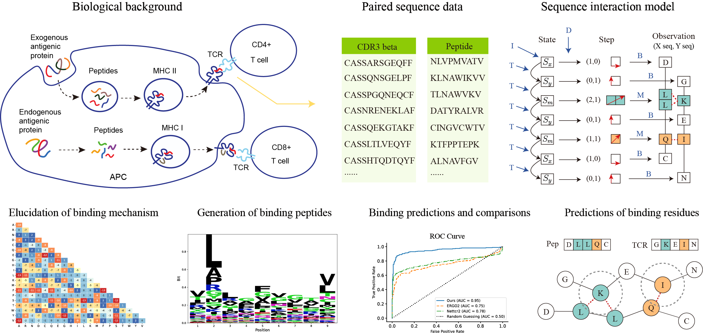
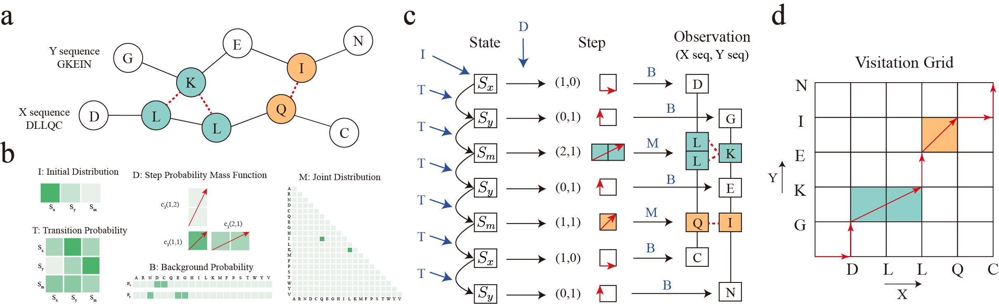

# SIM
`SIM` is a probabilistic generative model for sequence interaction. It is trained exclusively on positive data, capable of generating peptides that bind specifically to a given TCR repertoire, and can distinguish between the non-contributory residues and those that are crucial for binding.

<!-- framework.png -->
## Framework
SIM utilizes a training dataset consisting of numerous paired sequences, where the first column includes the CDR3beta regions of TCR sequences and the second column lists the corresponding binding peptides. Model parameters were derived from this training data. Following parameter estimation, peptides capable of binding to specific TCR repertoires were synthetically generated and their sequence logos were displayed. The effectiveness of the model was assessed on a testing dataset by comparing the area under the ROC curve (AUC) with those of existing algorithms. Additionally, the binding residues identified by the model for each sequence pair were validated through experimental structural data.


## Model
The following figure shows how SIM models the paired sequence data.

a). A pair of binding sequences. The red dashed line represents the potential interactions. b). Model parameters of SIM. The depth of the color indicates the magnitude of the parameter value. c). Data generation process. We show how SIM models the paired sequences, i.e., how the paired sequences is generated. The black arrows represent samples drawn from a specific distribution. The dark blue letter and arrow denote the parameters involved in this sampling process. The colored areas highlight residues with interactions. d). Visitation grid. The steps in the sampling process form a path from the origin to the top-right corner. The horizontal and vertical axes represent the observed amino acids in sequences X and Y, respectively. Each red arrow indicates a step. The colored areas mark the amino acids with interactions.


## Installation
You can install the released version of SIM from GitHub with:
1. Clone the GitHub repository and move to the directory
```bash
git clone https://github.com/RanLIUaca/SIM
```
or download the SIM-main.zip file and unzip it.


2. (Recommended) Create a virtual environment 
```bash
# conda deactivate
conda create --name sim_venv python=3.8
conda activate sim_venv
```

3. Install the required packages 
```bash
cd SIM/sim
python -m pip install .
```

Then you can enter the python and test the package.

## Usage
The software's functionality is demonstrated in the `demo.ipynb` file.


## Reference
-   Liu, R., Tang, X., Fan, X. (2025+), Sequence interaction model with applications to TCR-peptide binding, working Paper.
